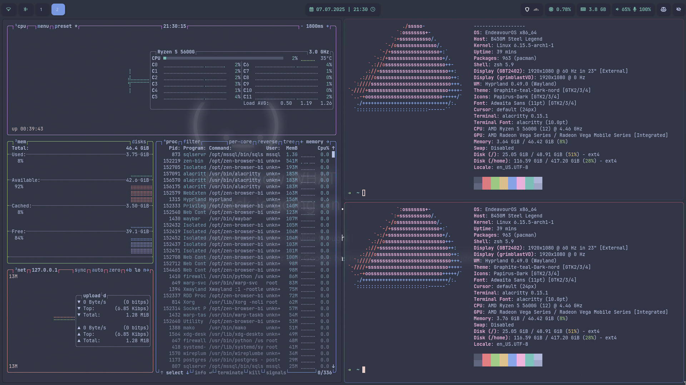
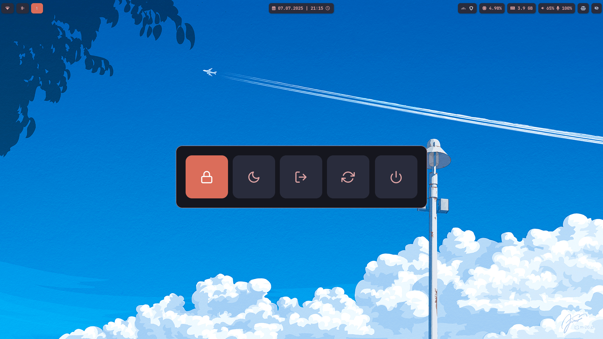
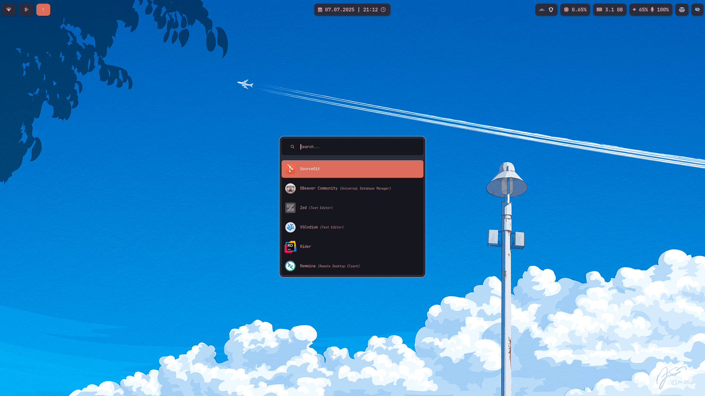
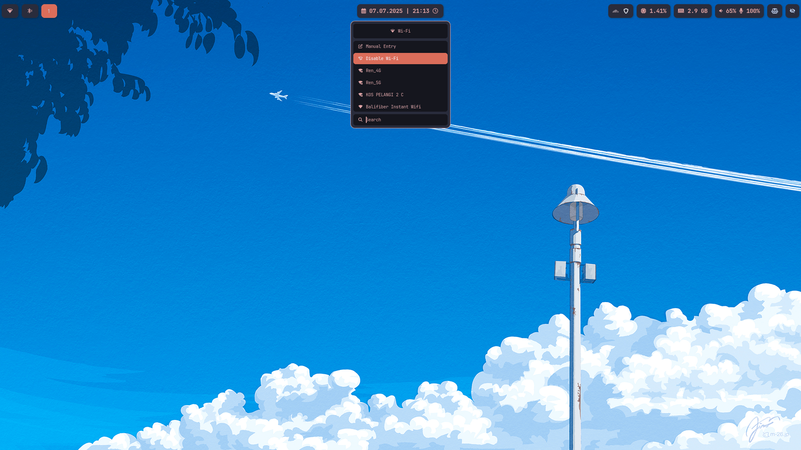

# dotfiles

## Screenshots









## Video Demo

<video src="https://raw.githubusercontent.com/fahri-r/dotfiles/main/.assets/demo.mp4" controls width="600"></video>

<details>
<summary>Project Structure</summary>

```
.
├── alacritty
│   └── .config
│       └── alacritty
├── btop
│   └── .config
│       └── btop
├── hypr
│   ├── .config
│   │   └── hypr
│   │       └── scripts
│   └── .local
│       └── bin
├── kitty
│   └── .config
│       └── kitty
├── mako
│   └── .config
│       └── mako
├── rofi
│   └── .config
│       └── rofi
│           ├── bluetooth
│           ├── clipboard
│           ├── launcher
│           ├── powermenu
│           └── wifi
├── services
│   └── .config
│       └── systemd
│           └── user
│               └── graphical-session.target.wants
├── themes
│   ├── .config
│   │   ├── alacritty
│   │   │   └── themes
│   │   ├── btop
│   │   │   └── themes
│   │   ├── hypr
│   │   ├── mako
│   │   │   └── themes
│   │   └── rofi
│   │       └── themes
│   ├── .local
│   │   ├── bin
│   │   └── share
│   │       ├── fonts
│   │       ├── icons
│   │       │   ├── Papirus
│   │       │   ├── Papirus-Dark
│   │       │   └── Papirus-Light
│   │       └── themes
│   │           ├── Graphite-teal-Dark-nord
│   │           └── Graphite-teal-Light-nord
│   └── Pictures
│       ├── dark
│       └── light
├── Thunar
│   ├── .config
│   │   └── Thunar
│   └── .local
│       └── bin
├── uwsm
│   └── .config
│       └── uwsm
├── waybar
│   └── .config
│       └── waybar
│           └── custom
└── zsh
```
</details>
